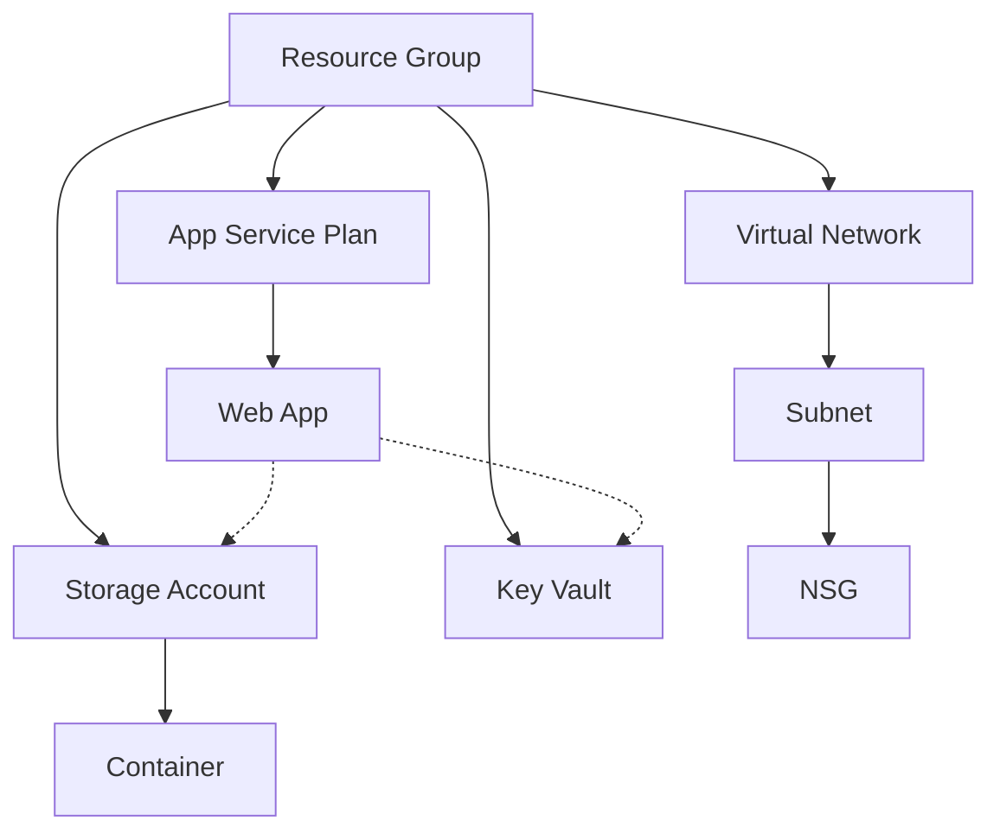

# Architecture Diagrams

This directory contains architecture diagrams for the Terraform project - both automatically generated and manually created.

## Overview Diagram

The following diagram illustrates the high-level architecture of the resources provisioned by this Terraform project:

```
                                     +-------------------+
                                     | Azure Resource    |
                                     | Group            |
                                     +-------------------+
                                              |
                    +---------------------+---+---+---------------------+
                    |                     |       |                     |
          +---------v---------+ +---------v-----+ +---------v--------+ +--------v---------+
          |                   | |               | |                  | |                  |
          | Virtual Network   | | Storage       | | App Service      | | Key Vault        |
          | + Subnet          | | Account       | | Plan + Web App   | |                  |
          | + NSG             | | + Container   | |                  | |                  |
          |                   | |               | |                  | |                  |
          +-------------------+ +---------------+ +------------------+ +------------------+
```

## Automated Diagram Generation

We've implemented automated diagram generation from our Terraform code using the script at `../../scripts/generate_diagrams.py`. This ensures our diagrams always reflect the current infrastructure.

## Network Architecture

```
+-------------------+
| Virtual Network   |
| 10.0.0.0/16      |
+-------------------+
         |
         |
+--------v--------+
| Subnet          |
| 10.0.1.0/24     |
+-------------------+
         |
         |
+--------v--------+
| NSG             |
| - HTTP(S)       |
| - SSH           |
+-----------------+
```

## Generating Updated Diagrams

### Automated Generation

To generate updated diagrams automatically, run:

```bash
# Install requirements
pip install terraform-visual graphviz diagrams

# Generate diagrams
python scripts/generate_diagrams.py
```

### Visualization Tools

We use multiple visualization tools:

1. **terraform-visual**: For infrastructure-as-code diagrams
2. **Diagrams**: For Python-based architecture diagrams
3. **Mermaid**: For Git-friendly diagrams in Markdown

### Live Infrastructure Map

Our implementation includes a dynamic infrastructure map that updates in real-time as resources are created, updated, or destroyed. This provides a living documentation of our environment.

## CI/CD Integration

These diagrams are automatically regenerated during our CI/CD pipeline whenever:

1. New infrastructure changes are pushed to main
2. Pull requests modifying infrastructure are created
3. Weekly scheduled runs to detect drift

The pipeline also validates that our diagrams match the actual deployed infrastructure.

Example Mermaid diagram (can be rendered in GitHub Markdown):



## Guidelines for Diagrams

1. Update diagrams whenever architecture changes
2. Include both high-level and detailed diagrams
3. Add explanatory notes for complex components
4. Generate diagrams programmatically when possible
5. Use consistent styling across all diagrams
